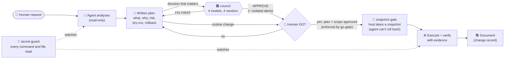

# agent-ops-guardrails

**An operating model for an AI agent that runs real infrastructure: the guardrails, the method, and the field notes.**

I let an AI agent run my homelab: a hypervisor, about forty containers, backups and a VPN. The agent is Claude Code; the reviewers in the council come from four different vendors. It has root, and it is good at the work. It is also confidently wrong a few times a week, and early on it printed secrets into its own transcript.

This repo collects the guardrails that grew around it. Each one exists because something went wrong once.

## The principle in one picture

Each layer answers one way an AI ops agent fails. None of them is enough alone.

| Failure mode of the agent | Guardrail | Status |
|---|---|---|
| Confidently wrong plan: a wrong diagnosis, an inconsistent threshold, a missed risk | [**council/**](council/): four models from different vendors review the written plan. The verdict is computed from their votes, and a lone blocking objection is never merged away. | ✅ code |
| Prints a secret by accident (`docker inspect`, `crontab -l`, an error message carrying a URL with credentials) | [**secret-guard/**](secret-guard/): a hook refuses commands that may print secrets unless their whole output goes through a masking filter, and blocks direct reads of secret files. | ✅ code |
| A secret ends up in a transcript anyway (no pattern list is complete) | [**leak-check/**](leak-check/): a root job looks for the *real* secret values (env files, passwords inside URLs, private keys) in what the agent produced, on the server and, after a daily copy, on the laptop. Each run starts with a canary. A hit is a leak, not a guess. | ✅ code |
| Acts without being asked, or beyond what was approved | [**go-gate/**](go-gate/): a hook that allows changes only inside a plan the human approved with a GO (scope + expiry). Reads stay free. Observe mode by default. | 🧪 code, experimental |
| Skips checks | **Change procedure**: analyse → plan → explicit GO → dry-run → execute → verify with evidence → document. | 📄 [described](docs/method.md#1-the-change-procedure) |
| Breaks something during an upgrade | **Snapshot gate**: the agent *requests* a snapshot; the host takes it. The agent can never roll back or delete. | 📄 [described](docs/method.md#3-an-on-call-agent-that-cannot-undo) |
| Has too much power when working alone | **On-call restrictions**: a least-privilege role, and denial tests that are harmless if they unexpectedly succeed. | 📄 [described](docs/method.md#4-denial-tests-must-be-harmless) |

## Start here

- **See what you get:** a real [council report](examples/council-report.md) and the hook's real [refusals](examples/secret-guard-refusals.md).
- **Install secret-guard:** `./install.sh` (add `--write-settings` to register the hook in `~/.claude/settings.json`; a backup is made).
- **Questions?** The [FAQ](docs/faq.md) covers: why several LLMs, cost, use with other agents, false positives, limits, adapting it to your setup.
- **Review plans with several models:** [council/README.md](council/README.md). Works with any OpenAI-compatible endpoint.
- **Stop secret leaks in Claude Code:** [secret-guard/README.md](secret-guard/README.md). Two files to install, plus a settings snippet.
- **Measure real leaks, not pattern scores:** [leak-check/README.md](leak-check/README.md). It found 4 real leaks the pattern hook had missed, including an SSH key giving root on a container.
- **Make the GO mechanical (experimental):** [go-gate/README.md](go-gate/README.md). Start with `simulate.py` on your own history, then a week in observe mode.
- **The whole method and the incidents behind it:** [docs/method.md](docs/method.md).

## Results, honestly

[docs/results.md](docs/results.md) opens with one table of every measure, its value, and how independent it is. In short:
- **council:** a backtest on my agent's real past mistakes, what it caught, and its false alarms;
- **secret-guard:** 75–85% agreement with blind test sets written by other models, a measure of coverage, not of leaks;
- **leak-check:** real leaks found in real transcripts. It is a floor, not a total: each report says what was checked.

go-gate's [simulation](go-gate/README.md#our-numbers-simulation-before-installing) on 11,000 past tool calls: only about 45% of the agent's changes came within 2 h of a short explicit approval (a measure of proximity in time, not a replay). That is the reason the gate exists, and the reason it starts in observe mode.

These are one person's field notes, not a benchmark.

## License

MIT. Personal project by [renocz](https://github.com/renocz).
