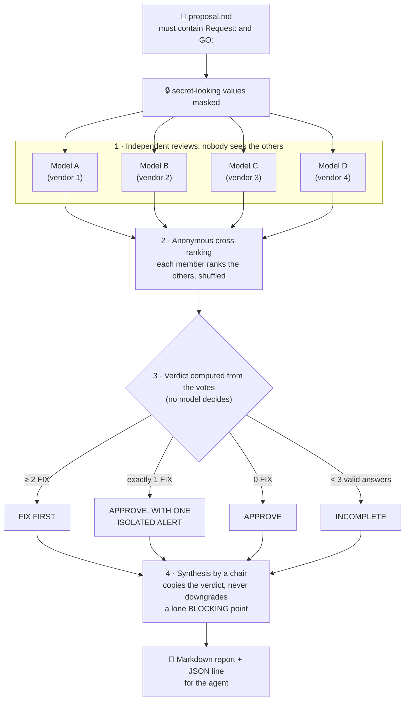

# council

**A multi-model review gate for changes proposed by an AI ops agent.**

Before a change that matters, the agent writes down its plan. Four models from different vendors review that plan, and the verdict is computed from their votes, not decided by a model.

It is a ~250-line, standard-library Python script. The script itself is not the interesting part. The interesting parts are the rules around it, and the record of what it caught and what it missed ([results](../docs/results.md)).

> "LLM council" is not a new idea: see Karpathy's [llm-council](https://github.com/karpathy/llm-council) and its many forks. This is one narrow use of it: a review gate in front of an agent that can break things, with the boring details that made it work.

## How it works



Each review lists its problems as `BLOCKING:`, `TO FIX:` or `MINOR:` and ends with `VERDICT: APPROVE` or `VERDICT: FIX`. A real `BLOCKING:` line counts as a FIX vote even if the member wrote APPROVE. An answer with no verdict line counts as absent, never as an approval.

The rules that came from real failures:

| Rule | Why |
|---|---|
| The proposal must quote the human's request **verbatim** (`Request:`) and say whether a **GO** was given (`GO:`). Otherwise it is refused. | Without that context, reviewers flagged "built without approval" on a plan the human had explicitly asked for, and missed the real flaw. |
| The verdict is **computed from the votes**. The chair only writes the summary. | The first version let the chair, who is also a member, decide. In its own review, the council flagged that as judge and party. |
| A BLOCKING point raised by **one** member is shown as an *isolated alert* and never merged away. | A summary-by-consensus rule had quietly downgraded a lone, correct objection. |
| Secret-looking values in the proposal are masked **before** anything leaves the machine (the `context` string from your config is sent as written) (best effort: common key formats, `Bearer`, `--token`, `key=`/`password:`, URL credentials, PEM). | The proposal goes to four external providers. Regexes are not a guarantee: never paste a secret on purpose. |
| Members come from **different vendors**. No personas, no multi-round debate. | Clones share their blind spots, and extra debate rounds added little. |
| Quorum: fewer than 3 valid answers → `INCOMPLETE`. An answer without a recognisable verdict counts as absent, never as an approval. | One member returned empty answers for a week (see [results](../docs/results.md)). |

## Quick start

```bash
export OPS_COUNCIL_API_KEY=...                 # key for any OpenAI-compatible endpoint (LiteLLM, OpenRouter, ...)
cd council && cp council.example.json council.json           # set api_base, members, chair, language
cat > proposal.md <<'EOF'
Request: "update the auth service, there is a security fix"
GO: yes, for this update only

Plan: ZFS snapshot first (abort if it fails), pin v2.18.0 in compose, dry-run, recreate only that container,
verify health + OIDC discovery. Rollback: previous tag, restore data from the snapshot.
EOF
python3 ops_council.py --title "auth service update" < proposal.md
```

`api_base` may be `http://host:port`, `.../v1` or the full `.../chat/completions` URL. Provider-specific request fields (for example a reasoning effort) go in `model_overrides`, keyed by model-name prefix; check what your endpoint accepts.

It writes a Markdown report to `reports_dir` and prints a JSON line (`verdict`, `votes`, `synthesis`, ...) for the agent to act on. A run makes 9 model calls and costs roughly $0.10–0.25 with frontier models.

Tests run offline: `python3 -m unittest -v test_council.py`.

