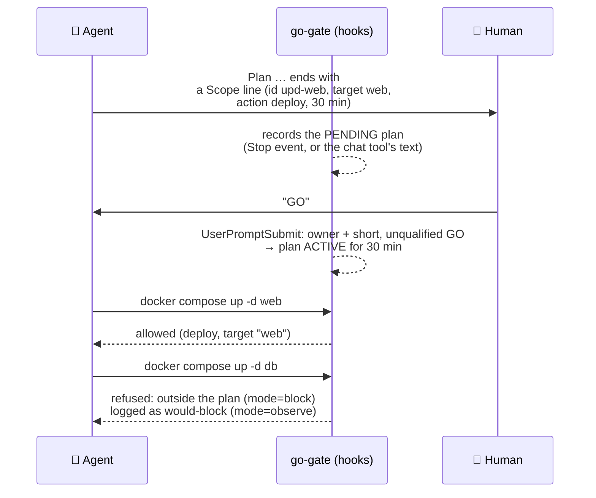

# go-gate (experimental)

A Claude Code hook that lets the agent **change** things only inside a plan the human approved with a GO. Reads stay free.

> **Status: experimental. Observe mode by default.** Run it in observe mode for a week on your own work before you switch on blocking. Our own numbers are below: blocking on day one would have refused about half of the agent's past changes.

## Why

**The number that made me build it:** replaying my agent's history, only **45%** of its 4,693 changes came within 2 hours of a short explicit approval from me ([details](#our-numbers-simulation-before-installing)). A written rule is not a constraint.

"No change without an explicit GO" was a rule in my agent's instructions for weeks. Instructions are not enforcement. Twice the agent acted outside what I had approved:
- **30/09:** a test that "should be refused" actually rolled back a container.
- **05/10:** a GO to *prepare* a hook locally ended in the hook being deployed.

go-gate turns the rule into a mechanism. It targets the agent's **mistakes**: acting before the GO, or beyond what was approved. It is **not** a sandbox against an agent trying to get around it, since the agent can usually edit its own hooks. Least privilege is that barrier: give the agent rights it cannot misuse. See [Limits](#limits).

## How it works



1. **Plan.** The agent ends a proposal with a scope line:
   `Scope: id=<short> ; targets=<hosts, services, paths> ; actions=<categories> ; ttl=<minutes>`. `Périmètre :` works too.
   - Categories: `edit`, `doc`, `git`, `deploy`, `api`, `browser`, `delete`, `script`.
   - The hook takes the line from the agent's last message (Stop event) or from a message it sends through a chat tool, such as a Telegram reply.
2. **GO.** The approval is a human message that is **only** one of GO, OK, OKAY, OUI, YES, VAS-Y or VAS Y (any case, trailing `!` or `.` allowed), optionally followed by the plan id.
   - Anything else does not count: "attends mon GO", "faut-il un GO ?", "GO but only prepare", "ok mais pas…", "GO p1 si les tests passent".
   - `GO <id>` must name the pending plan.
   - `stop`, `annule` or `cancel` at the start of a message revokes the plan, and so does a message that is only `non` or `no`. "non non, continue" does not.
   - Only the owner counts: prompts typed in the terminal, and channel messages whose `user_id` is listed in `owner_ids`.
   - When a GO activates a plan, the hook tells the agent what was approved (id, targets, actions, minutes) and asks it to restate that in one line. A one-word GO then comes back as a visible commitment, not a reflex.
3. **Gate.** Before every tool call, the hook classifies it:
   - **read / talk:** always allowed. This covers `ls`, `cat … | mask`, `docker ps`, `git log`, `curl` GET, Read, Grep, and chat replies.
   - **change / opaque:** allowed only if the active plan is unexpired, lists the action's category, and, when targets are listed, one of them appears in the call.

The classifier is **default-deny**. A Bash command is a read only if every stage of every statement is a known read-only command:
- with no writing option (`sed -i`, `sort -o`, `find -delete/-exec/-fprint`, `curl -o/-X POST/-d`, `tee file`…);
- with no redirection to a file outside `/tmp` or the scratchpad;
- with nothing writing inside `$( … )`.

Wrappers whose inner command is a literal string are unwrapped and judged on that inner command: `ssh host '…'`, `pct exec N -- …`, `docker exec c …`, `bash -c '…'`. A wrapper that can't be unwrapped is **opaque** and needs `actions=script`: `bash script.sh`, `eval`, `$CMD`. Inline Python (`python3 -c`, `python3 - <<EOF`, or a script file that exists) counts as a read only when it imports nothing beyond pure modules (`json`, `re`, `sys`, `math`, `datetime`, `collections`…) and uses no dynamic access (`getattr`, `__import__`, `globals`…). Since v0.9: `from os import remove as r` used to pass as a read.

## Our numbers (simulation before installing)

`simulate.py` replays your own transcripts through the classifier, and nothing is installed or written. On my Mac (22 sessions, 11,164 tool calls):

| Kind | Share |
|---|---|
| read | 47% |
| change | 30% |
| opaque | 12% |
| talk (chat replies) | 11% |

Of the 4,693 changes, **45%** came within 2 h of a short approval from me. This is a measure of proximity in time, not a replay of the gate: past proposals had no scope line, so scopes can't be checked after the fact. The other 55% is a mix:
- sessions resumed from a summary, where the GO sat in the earlier session (the simulator can't see it);
- browser clicks for settings I had asked for;
- docs and commits after a change;
- old standing exceptions;
- a few real slips.

So in block mode, the gate would have refused about half of the past changes, as an order of magnitude; the missing approvals from earlier sessions make this an overestimate. It only works with the habit it enforces: every proposal ends with a scope line, and the human answers with one word. Run `simulate.py` on your own history first.

```
python3 simulate.py --owner-id <your channel user_id>      # add one per channel identity
```

## Install (observe mode)

go-gate reuses secret-guard's shell splitter: keep `secret_guard.py` next to it, or install secret-guard first.

```bash
cp go-gate/go_gate.py ~/.claude/hooks/go-gate.py
mkdir -p -m 700 ~/.claude/go-gate
cat > ~/.claude/go-gate/config.json <<'EOF'
{ "mode": "observe", "owner_ids": ["<your channel user_id>"], "ttl_minutes": 120, "max_ttl_minutes": 240 }
EOF
```

Then add to `~/.claude/settings.json`:

```json
{
  "hooks": {
    "UserPromptSubmit": [{ "hooks": [{ "type": "command", "command": "python3 ~/.claude/hooks/go-gate.py", "timeout": 10 }] }],
    "Stop":             [{ "hooks": [{ "type": "command", "command": "python3 ~/.claude/hooks/go-gate.py", "timeout": 10 }] }],
    "PreToolUse":       [{ "matcher": "*", "hooks": [{ "type": "command", "command": "python3 ~/.claude/hooks/go-gate.py", "timeout": 10 }] }],
    "PostToolUse":      [{ "matcher": "mcp__plugin_telegram_telegram__reply", "hooks": [{ "type": "command", "command": "python3 ~/.claude/hooks/go-gate.py", "timeout": 10 }] }]
  }
}
```

Then tell the agent the convention, in CLAUDE.md or its system prompt: *"End every proposal of a change with a `Scope:` line; act only after my GO."*

- **Observe mode** never blocks. It logs to `~/.claude/go-gate/log.jsonl`: `allowed`, `would-block`, `approved`, `plan-proposed`, `go-with-reservation-ignored`…
- **Switching to block mode:** decide the criterion before you start, or observe mode becomes permanent. Mine: after 7 days, every would-block is classified by hand as a real slip, a missing scope line, a GO the grammar rejected, or a classifier false positive (a read judged a change), and classifier false positives are under 5% of all would-blocks. The other classes are fixed by habit (scope lines, plain GOs), not by the classifier. Fix your habits or the classifier, then set `"mode": "block"`.
- **The log** holds the category, a short reason and the command words only (`docker compose`, `git push`, `curl`), never their arguments: anything with `=`, `:`, `@` or quotes becomes `<…>`. It never holds message text. Secrets the agent might read on screen are secret-guard's job, not go-gate's.

## Limits

- **Not a sandbox.** The agent runs as your user. It can edit `settings.json`, the hook or its state file, and the hook only flags such edits as changes. For real integrity, use the [keeper](../keeper/): the approval lives in a daemon under another user, and the hook is root-owned and registered in managed settings. Where the agent is root, as on my on-call container, no hook can protect itself: rely on least privilege.
- **Heuristic classifier.** It knows the common tools and judges inline Python by pattern. An unknown command counts as a change: safe, but noisy. A determined agent can hide a write; a careless one usually can't.
- **Fail-closed only in block mode, and only on errors the hook catches.** If the hook times out or the interpreter is missing, Claude Code lets the call through. Keep the timeout generous; the hook takes a few ms.
- **Targets are matched as text.** `targets=web` matches any call that mentions "web". Prefer precise names and paths.
- **One plan at a time, per session.** A new proposal replaces the pending plan, and approving it replaces the active one. Plans never cross sessions.
- **Known reads that write a little:** `git fetch` updates `.git` refs and `python3 -m py_compile` writes `__pycache__`; both count as reads. Unknown commands count as changes.
- **A compound command is checked action by action:** in `git add web; docker compose down`, both actions must be inside the plan.
- **Scratch paths are judged by their text.** `/tmp/x` counts as scratch even if it is a symlink to somewhere else; `..` is normalised, links are not followed.
- **Targets ignore where a command runs.** `ssh host`, `pct exec` and `docker exec` are unwrapped and the inner command is judged, but a target named in the plan is not tied to a host or container.
- **Since v0.9 (external audit of v0.8):** a plan sent through a chat tool becomes pending only after the send succeeded (PostToolUse); a pending plan expires after `pending_minutes` (120); a channel GO older than 15 minutes, older than the plan, or with a message_id already used is ignored; the GO words are matched as plain ASCII (`yeſ` or a Cyrillic O no longer count); for verbs with several objects (`docker restart db web`) every object must be in scope; an MCP tool whose name holds a write verb (`get_and_delete_…`) is a change; writes to the gate's state, the hooks or the settings are never covered by a plan, symlinks included.
- **Install and recovery.** Writes to the hooks and settings are never covered by a plan, so in block mode a human installs or updates the hooks (or switches to observe mode first). `ssh other-host '…'` is judged on the inner command; the host itself is not tied to the plan.
- **Still true:** the gate runs with the agent's rights and reads the text it writes. An agent that controls its own settings can switch it off, and the sender of a channel message is trusted from the message header. The [keeper](../keeper/) is that separate process: go-gate's classifier runs inside it, and approvals are button presses on a bot the agent cannot read.
- **A GET is a read, unless the URL looks like an action.** Webhooks, triggers and action words in the path (`/webhook/`, `/restart`, `/delete`…), `?action=`-style parameters and `X-HTTP-Method-Override` count as changes. Any other GET with a side effect still passes as a read.
- **SQL is not parsed.** A `SELECT` that calls a function with side effects counts as whatever the client command is judged to be.

## Tests

`python3 -m unittest test_go_gate.py`. It runs 112 Bash classifier cases (including every bypass found in review), the other tools, and the whole hook flow: GOs that must be ignored, scope, expiry, revocation, fail-closed, and no secrets in the log.
